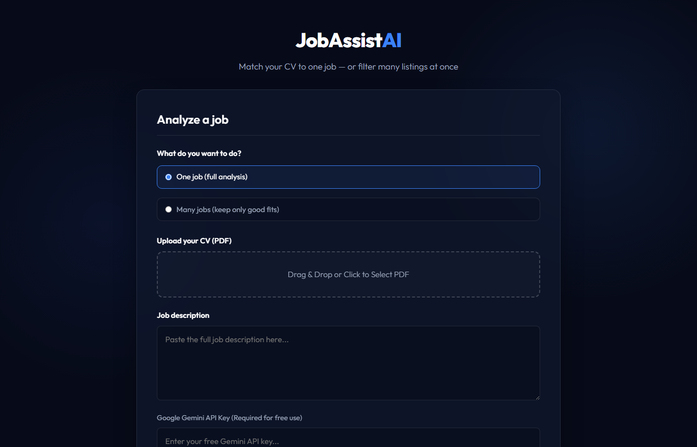

# JobAssist AI

An AI-powered job application assistant that analyzes your CV against job descriptions, scores fit, identifies red flags, and generates tailored application assets — all powered by Google Gemini.


---

## Overview



JobAssist AI helps job seekers make smarter application decisions by using AI to:

- **Single Job Analysis** — Upload your CV + paste a job description, get a detailed fit score (0-100), red flags, missing keywords, and AI-generated cover letter, CV summary, and LinkedIn recruiter message
- **Bulk Job Filtering** — Paste up to 12 job listings at once, get each one scored and ranked against your CV so you can focus on realistic opportunities

The AI reads your CV to infer your profile (skills, experience, languages, location) and compares it objectively against each job posting.

## Features

- PDF CV parsing with automatic text extraction
- AI-powered fit scoring (0-100) with color-coded results
- Smart recommendation engine: *Apply now*, *Apply with tailoring*, *Low chance*, *Do not apply*
- Red flag detection (language mismatch, seniority gap, missing skills)
- Missing keyword identification
- Auto-generated tailored assets:
  - CV summary matched to the job
  - Cover letter draft
  - LinkedIn recruiter message
- Bulk mode: score up to 12 jobs in one request
- Filter to show only worth-applying roles
- Dark-themed, modern UI with drag-and-drop upload
- Runs 100% locally — your CV never leaves your machine

## Tech Stack

| Layer | Technology |
|-------|-----------|
| Backend | Python, FastAPI, Uvicorn |
| AI | Google Gemini 2.5 Flash (via google-genai SDK) |
| PDF Parsing | PyPDF |
| Frontend | Vanilla HTML, CSS, JavaScript |
| Validation | Pydantic |

## How to Run

### Prerequisites
- Python 3.9+
- Free Google Gemini API key ([get one here](https://aistudio.google.com/app/apikey))

### Setup

```bash
# Clone the repository
git clone https://github.com/Kevin19e/JobAssist-AI.git
cd JobAssist-AI

# Create virtual environment
python -m venv venv
source venv/bin/activate  # Windows: venv\Scripts\activate

# Install dependencies
pip install -r requirements.txt
```

### Run

```bash
python -m uvicorn backend.main:app --host 127.0.0.1 --port 8000 --reload
```

Open **http://127.0.0.1:8000** in your browser.

Or on Windows, double-click `run.bat`.

### Usage

1. Select mode: **One job** (full analysis) or **Many jobs** (bulk filter)
2. Upload your CV as PDF
3. Paste the job description(s)
4. Enter your Gemini API key
5. Click **Compute fit & generate**

For bulk mode, separate job listings with a line containing only:
```
---NEXT JOB---
```

## Project Structure

```
JobAssist-AI/
├── backend/
│   ├── main.py              # FastAPI server & API endpoints
│   ├── llm_assistant.py     # Gemini AI integration & analysis logic
│   └── pdf_handler.py       # PDF text extraction
├── frontend/
│   ├── index.html           # Main UI
│   ├── app.js               # Frontend logic & API calls
│   └── style.css            # Dark theme styling
├── assets/
│   └── app_overview.png     # Screenshot
├── requirements.txt
├── run.bat                  # Windows quick-start script
└── README.md
```

## How It Works

```
┌──────────────┐     ┌──────────────┐     ┌──────────────┐
│   Frontend   │────>│   FastAPI    │────>│  Gemini AI   │
│  Upload CV   │     │  Parse PDF   │     │  Score & Rank│
│  Paste Jobs  │<────│  Validate    │<────│  Generate    │
│  Show Results│     │  Route       │     │  Assets      │
└──────────────┘     └──────────────┘     └──────────────┘
```

1. User uploads CV (PDF) and pastes job description(s)
2. Backend extracts text from PDF
3. CV + job text sent to Gemini with structured output schema
4. AI returns fit score, recommendation, red flags, and tailored assets
5. Frontend renders results with visual scoring

## Skills Demonstrated

| Skill | What This Project Proves |
|-------|-------------------------|
| **Python** | FastAPI backend with async handlers and Pydantic validation |
| **AI Integration** | Structured output from Gemini API with JSON schema enforcement |
| **API Design** | RESTful endpoints with proper error handling and file uploads |
| **Frontend** | Modern UI with drag-and-drop, dynamic rendering, no frameworks |
| **PDF Processing** | Server-side document parsing |
| **Product Thinking** | Solving a real problem — making job applications more efficient |

## Future Improvements

- User profile configuration (save preferences, target roles, language skills)
- Job URL scraping — paste a link instead of copying text
- Application tracking — save and compare analyses over time
- Batch export to CSV/PDF
- Deployment to cloud (Railway, Render, or Vercel)

---

*Built with Python, FastAPI, and Google Gemini AI.*
